# 快速开始

本文以 **OPC UA Simulation Server（Prosys）** 为数据源，带你完成从 **安装 NG Gateway** 到 **创建南向 OPC UA 通道/设备/点位**，最终在「监控」中看到实时数据的全流程。

## 0. 前置条件

- **Docker Engine**
- 一台可运行 NG Gateway 的主机（Linux/macOS/Windows 均可）
- 一台安装并运行 OPC UA Simulation Server 的主机（可与 NG Gateway 同机）

## 1. 安装并启动 NG Gateway

本章节**只使用 Docker 安装**，直接使用默认配置开箱即用。

NG Gateway 采用 **All-in-one** 架构：

- **一个服务 `gateway`**：网关进程同时提供 **API（`/api`）+ Web UI（`/`）**

### 1.1 启动（docker run）

```bash
docker run -d --name ng-gateway \
  --privileged=true \
  --restart unless-stopped \
  -p 8978:8080 \
  -p 8979:8443 \
  -v gateway-data:/app/data \
  -v gateway-drivers:/app/drivers/custom \
  -v gateway-plugins:/app/plugins/custom \
  shiyuecamus/ng-gateway:latest
```

::: tip 关键提醒（务必检查/修改）：
- **端口映射**：如果宿主机端口被占用，修改 `-p` 左侧宿主机端口即可（如 `-p 18978:8978`）。文档后续示例默认使用 `8978`。
- **数据持久化**：请保留 `gateway-data` 卷，否则重启/升级容器会丢失 `data/` 下的`内置SQLite数据库`与`运行数据`。
- **自定义驱动/插件**：如果你会安装自定义 driver/plugin，请保留 `gateway-drivers/gateway-plugins` 卷，避免容器重建导致 **「驱动」** / **「插件」** 文件丢失。
- **Docker 网络地址**：后续在网关里配置南向设备地址时，**不要使用 `127.0.0.1` 指向宿主机服务**；请优先使用 **宿主机局域网 IP**
- **UI 访问**：Web UI 与 API 同端口（默认 `8978`），UI 为 `http://<host>:8978/`，API 为 `http://<host>:8978/api` 
:::

### 1.2 验证容器启动

```bash
docker ps
docker logs -f --tail=200 ng-gateway
```

### 1.3 升级（拉取新镜像并重建容器）

```bash
docker pull shiyuecamus/ng-gateway:latest
docker rm -f ng-gateway
docker run -d --name ng-gateway \
  --privileged=true \
  --restart unless-stopped \
  -p 8978:8080 \
  -p 8979:8443 \
  -v gateway-data:/app/data \
  -v gateway-drivers:/app/drivers/custom \
  -v gateway-plugins:/app/plugins/custom \
  shiyuecamus/ng-gateway:latest
```

## 2. 安装 Prosys OPC UA Simulation Server 模拟器

下载并安装 Prosys OPC UA Simulation Server：

- 下载地址：`https://downloads.prosysopc.com/opc-ua-simulation-server-downloads.php`

## 3. 运行模拟器并验证 Object

1. 启动 **OPC UA Simulation Server**。
2. 确认 Server 正常启动，并能在左侧 Object Tree 中看到自动创建的对象/变量。

### 重要提示

- **须保证 NG Gateway 与模拟器运行在同一局域网内**。
- Windows 环境建议尽量关闭防火墙或放通端口，否则可能出现网关无法连接到模拟器。
- 如果 NG Gateway 运行在 Docker 容器里，`127.0.0.1` 指向的是容器自身，不是宿主机；请优先使用 **宿主机局域网 IP**。

Prosys OPC UA Simulation Server默认为EndpointUrl：

- `opc.tcp://${本机局域网地址}:53530/OPCUA/SimulationServer`

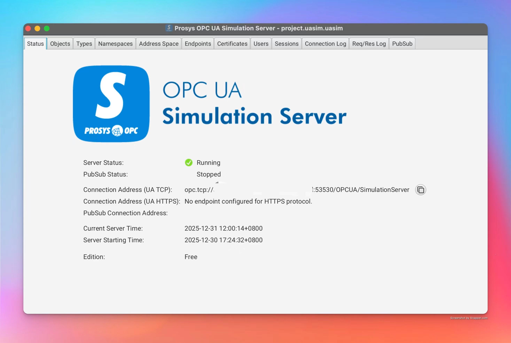

## 4. 打开 NG Gateway UI

默认 UI 地址：

- `http://x.x.x.x:8978/`

其中 `x.x.x.x` 为运行 `gateway` 服务所在主机的 IP（同机可用 `http://127.0.0.1:8978/`）。

## 5. 登录 Web UI

首次登录默认账号：

- **用户名**：`system_admin`
- **密码**：`system_admin`

> Tip：建议首次登录后及时修改密码

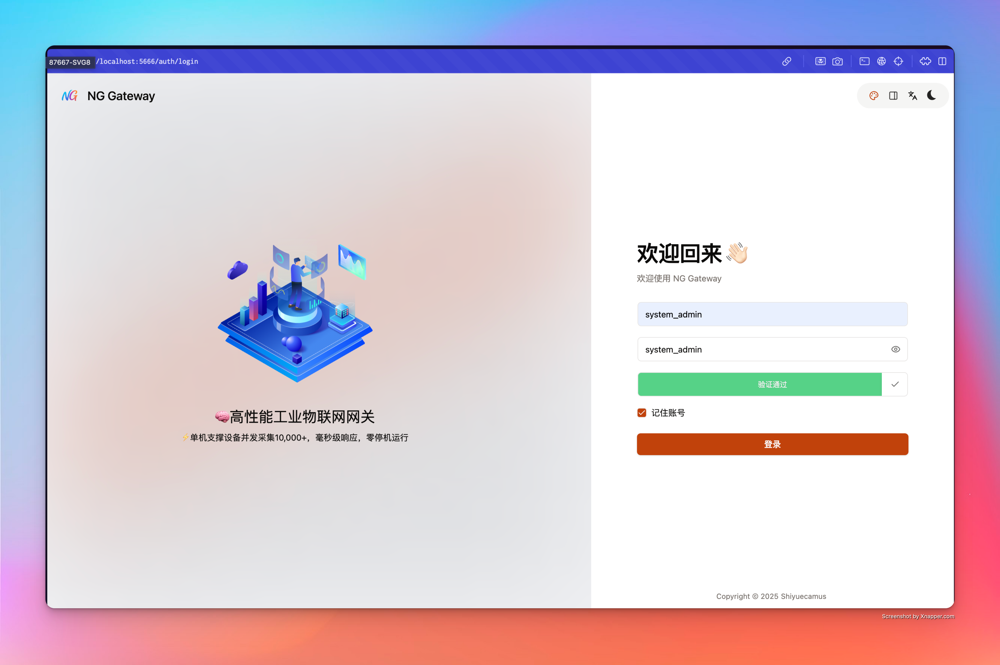

## 6. 添加南向通道

在左侧菜单选择 **「南向」->「通道」** 进入南向通道管理界面，点击 **「添加通道」** 创建新通道。

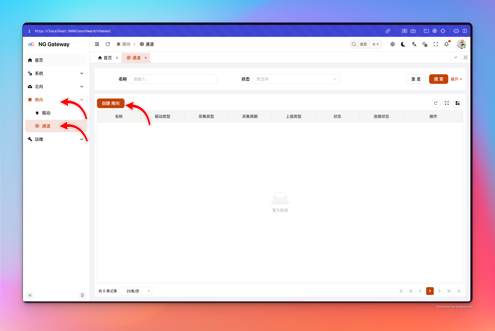

## 7. 南向通道配置

### 7.1 基础配置

- **名称**：通道名称
  - 示例：`opcua`
- **驱动**：选择 `OPC UA`
- **采集类型**
  - **被动上报（Report）**：设备/协议栈主动把数据推送给网关，网关被动接收（OPC UA 推荐配合「订阅」模式）
  - **主动采集（Collection）**：网关按周期主动向设备发起读取请求采集数据，需要配合「采集周期」
- **采集周期（period, ms）**：网关将其映射为后台异步采集任务的周期
  - 约束：仅当采集类型为 **主动采集（Collection）** 时生效且必填
- **上报类型（ReportType）**
  - **变更上报（Change）**：仅当数据值发生变化时，才会被路由到北向应用
  - **固定上报（Always）**：无论数据是否变化，都会持续路由到北向应用（高频点位请谨慎使用，避免北向与存储压力）

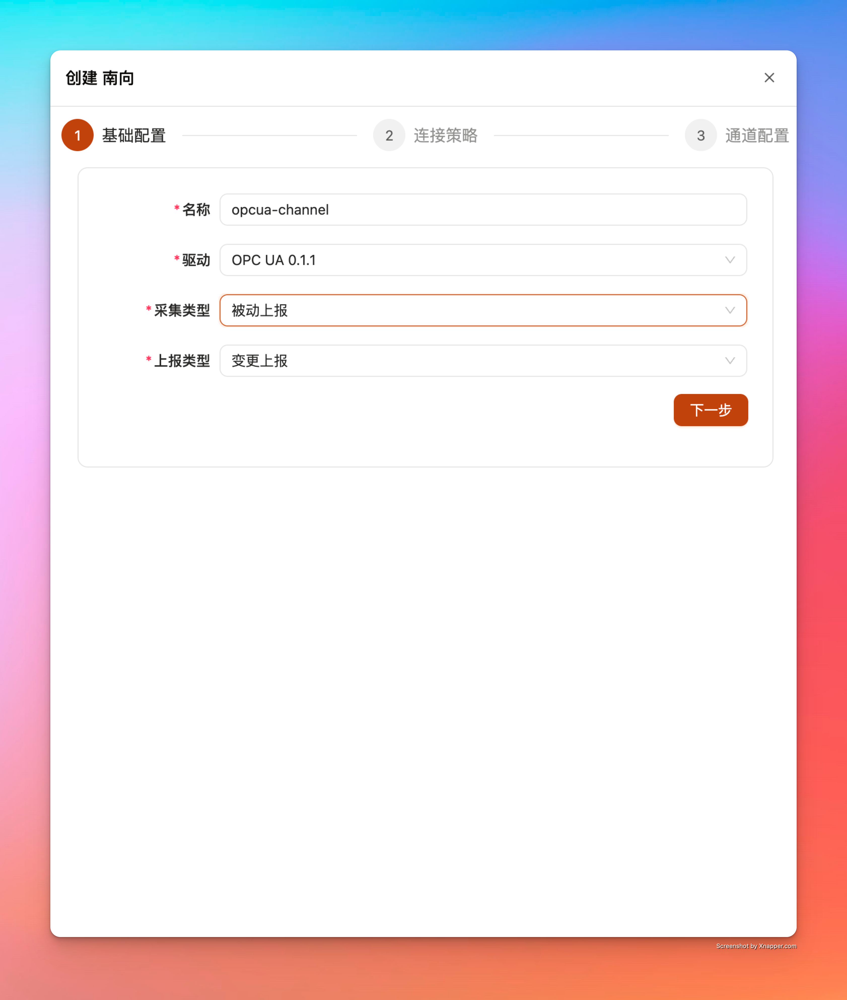

### 7.2 连接策略配置

该配置用于控制通道 **建立连接/读写请求超时** 以及 **断线重连退避策略**。

- **连接超时（connectTimeoutMs, ms）**
  - 语义：建立通道连接的超时时间
  - 默认： `10000`
- **读取超时（readTimeoutMs, ms）**
  - 语义：单次读取请求超时（通常用于主动采集的单次任务耗时控制）
  - 默认： `10000`
- **写入超时（writeTimeoutMs, ms）**
  - 语义：单次写入/控制请求超时（例如 `WritePoint` 或`Command`）
  - 默认： `10000`

#### 重试策略

用于通道断开/失败后的自动重连。

- **最大重试次数（maxAttempts）**
  - 语义：最大重试次数（`0` 表示不重试；空表示不限制次数）
  - 默认：`3`
- **初始间隔（initialIntervalMs, ms）**
  - 语义：第一次重试前等待时间
  - 默认：`1000`
- **最大间隔（maxIntervalMs, ms）**
  - 语义：重试等待时间的上限
  - 默认：`30000`
- **随机因子（randomizationFactor）**
  - 语义：范围 \([0.0, 1.0]\)，用于引入抖动避免“惊群”
  - 示例：`0.2` 表示在每次退避间隔上引入 **±20%** 的随机浮动
  - 默认：`0.2`
- **倍增系数（multiplier）**
  - 语义：每次重试间隔的倍增系数，典型为指数退避 `2.0`
  - 默认：`2.0`
- **最大耗时（maxElapsedTimeMs, ms）**
  - 语义：可选的“总耗时上限”（达到后停止重试）；为空表示不限制总耗时
  - 默认：空（不限制）

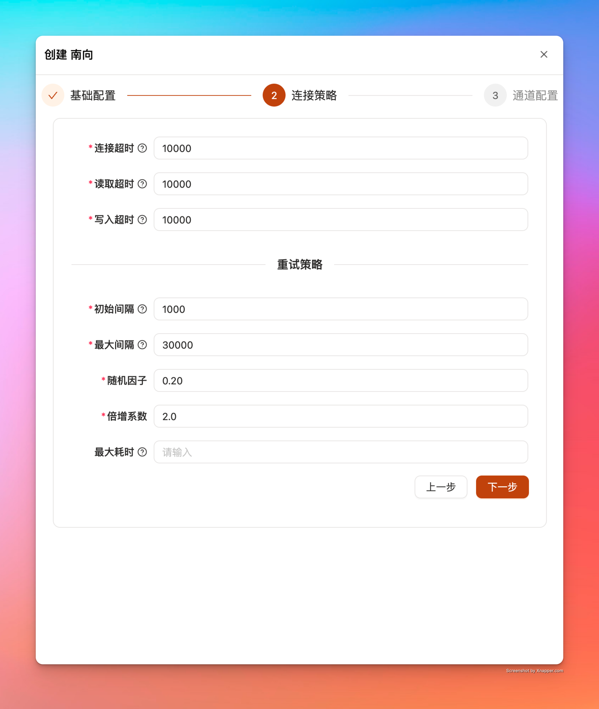

### 7.3 驱动配置

- **应用名称（applicationName）**
  - 语义：OPC UA Client 的 ApplicationName
  - 示例：`SimulationServer@my-host`
- **应用 URI（applicationUri）**
  - 语义：OPC UA Client 的 ApplicationUri
  - 示例：`urn:my-host.local:OPCUA:SimulationServer`
- **服务器地址（url）**
  - 语义：OPC UA Server 的 EndpointUrl
  - 语法：`opc.tcp://{host}:{port}/{path}`
  - 示例（同机局域网）：`opc.tcp://${本机局域网地址}:53530/OPCUA/SimulationServer`
- **认证方式（auth）**
  - **匿名（Anonymous）**：默认安装 Simulation Server 后通常无需配置即可使用
  - **用户名密码（UsernamePassword）**：需填写用户名与密码
  - **颁发令牌（IssuedToken）**：需填写 `token`；当前实现按 **Base64** 解码为字节串
  - **证书（Certificate）**：需填写 `privateKey` 与 `certificate`（注意：这里填写的是 **证书/私钥 PEM 文本内容**，不是文件路径）
- **安全策略（securityPolicy）**：`None` / `Basic128Rsa15` / `Basic256` / `Basic256Sha256` / `Aes128Sha256RsaOaep` / `Aes256Sha256RsaPss`
- **安全模式（securityMode）**：`None` / `Sign` / `SignAndEncrypt`
- **采集模式（readMode）**
  - **订阅（Subscribe）**：通过 Subscription 实时接收变化（配合 **「被动上报」**）
  - **周期读取（Read）**：按周期发送 Read 请求（配合 **「主动采集 + 采集周期」**）
- **会话超时（sessionTimeout, ms）**
  - 语义：OPC UA Client 会话超时时间
  - 默认：`30000`
- **最大失败保活次数（maxFailedKeepAliveCount）**
  - 语义：连续多少次 KeepAlive 失败后，认为连接不可用并触发重建/重连
  - 默认：`3`
- **保活间隔（keepAliveInterval, ms）**
  - 语义：KeepAlive 心跳间隔
  - 默认：`30000`
- **订阅批量大小（subscribeBatchSize）**
  - 语义：创建/修改/删除 MonitoredItem 的批量大小；点位很多时可减少单次请求体积与失败面
  - 默认：`256`

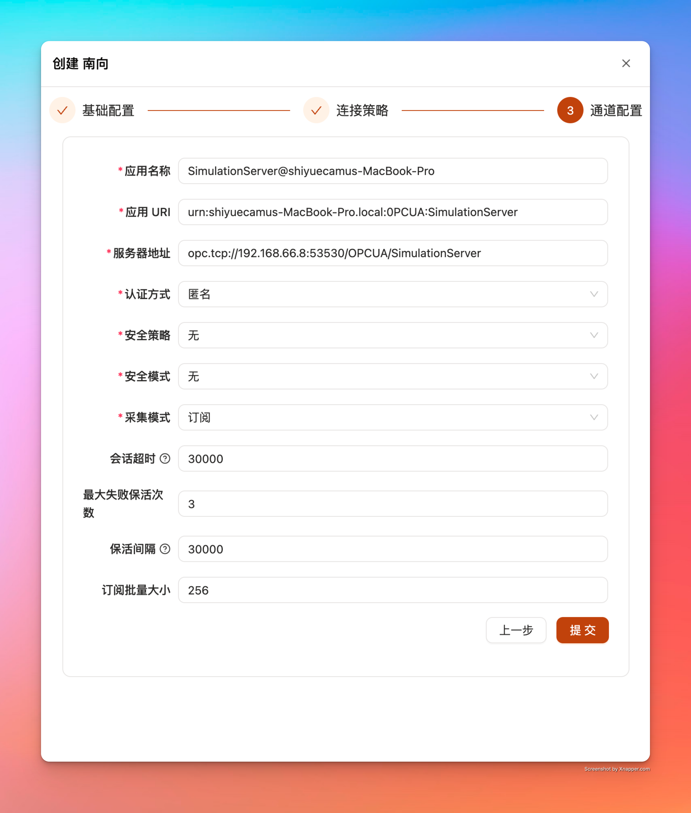

## 8. 提交创建通道并观察状态

点击 **「提交」** 创建通道，然后在通道列表观察：

- **状态**：启用/禁用（成功连接通道后通常默认启用）
- **连接状态（runtime）**：`Disconnected` / `Connecting` / `Connected` / `Reconnecting` / `Failed`

::: tip
如果连接状态为 `Failed`，优先检查：Endpoint URL 是否可达、防火墙、以及安全策略/认证是否匹配。
:::

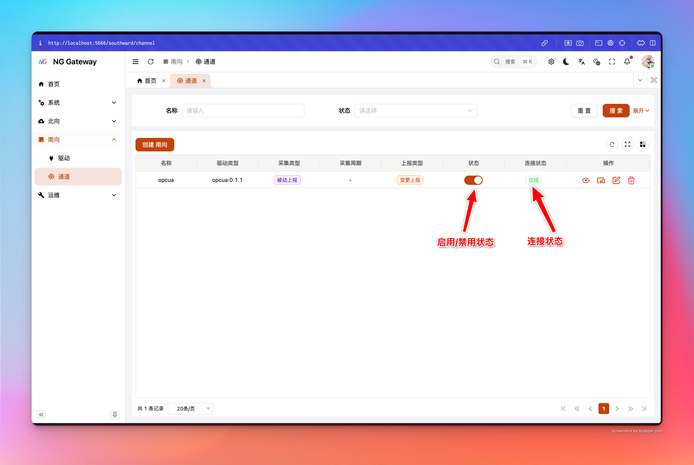

## 9. 创建通道子设备

::: tip
通道下子设备、点位、动作的新增入口包含`ui`、`excel导入`两种，且`ui`、`excel` **模版**均根据驱动metadata schema动态渲染，无需额外编写代码。本文档示例以**ui**为入口示例 
:::

点击通道表格 **「操作」** 列的 **「子设备」** 打开子设备管理弹窗，点击 **「创建设备」**。

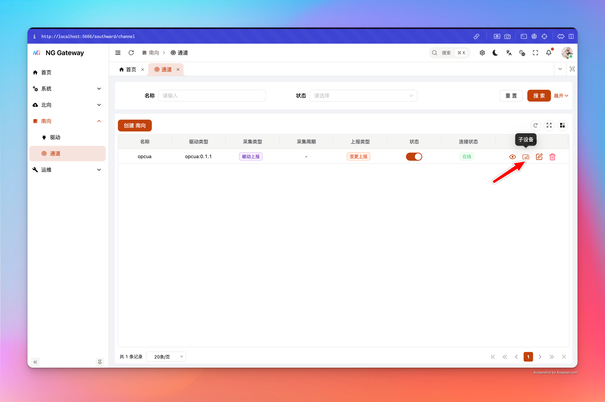 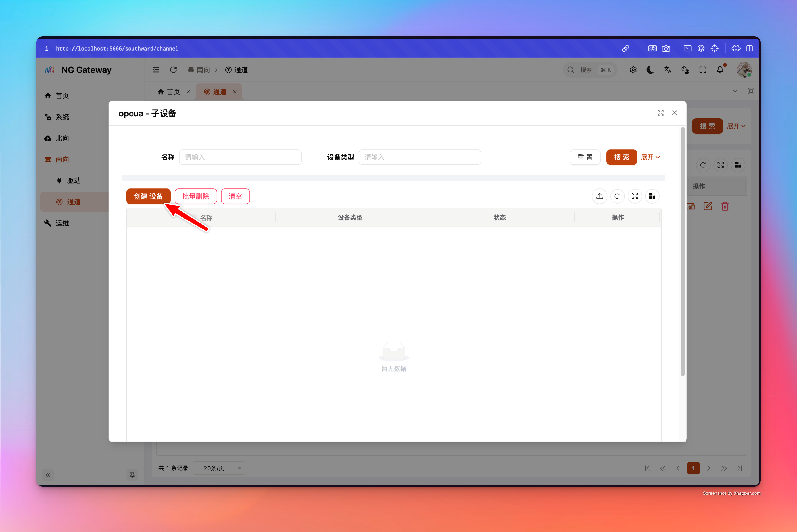

### 9.1 设备配置

- **名称**：例如 `opcua-device`
- **设备类型**：例如 `Sensor`
- **驱动配置**：OPC UA 示例暂无设备级特有配置

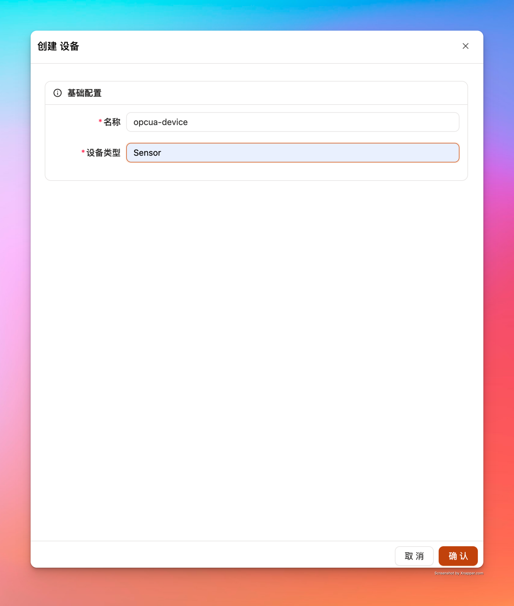 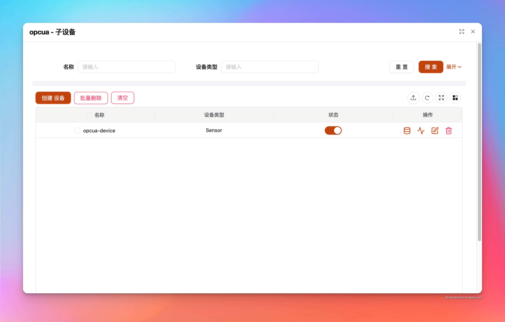

## 10. 创建点位

在子设备表格 **「操作」** 列点击 **「点位管理」** 打开点位管理弹窗，点击 **「创建点位」**。

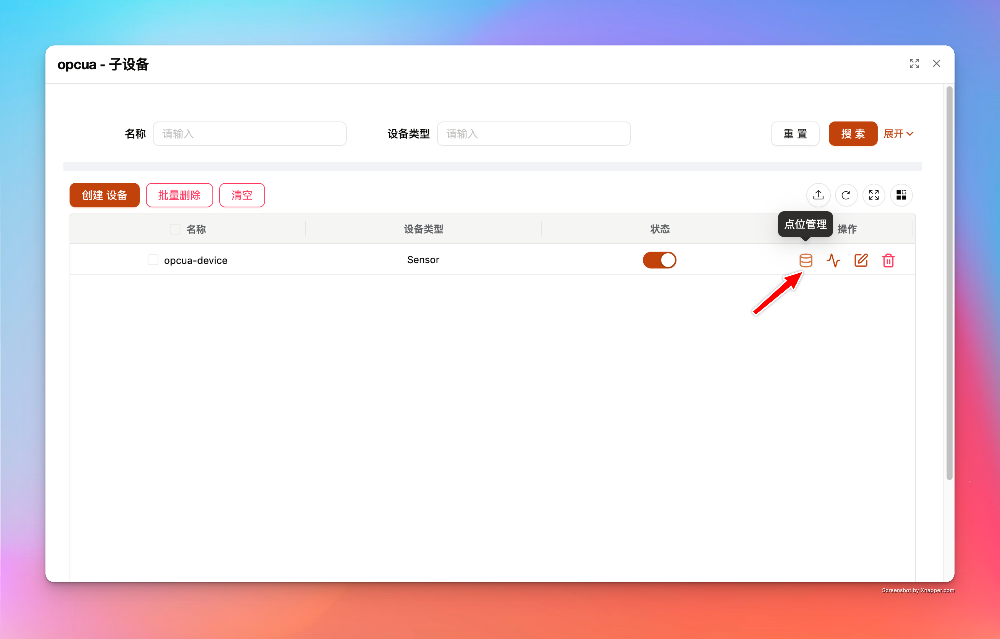 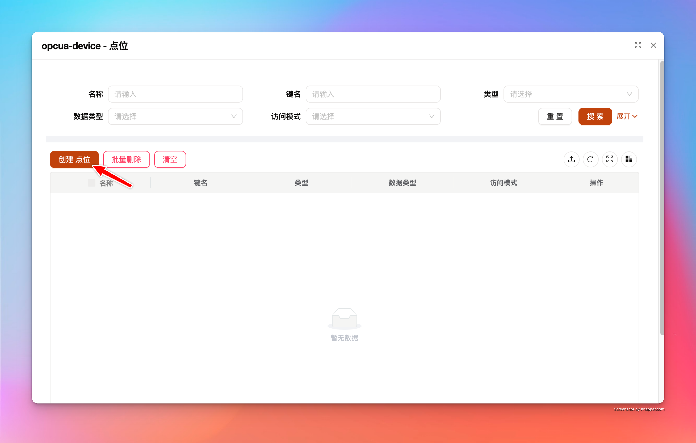

### 10.1 点位基础配置

- **点位名称**
  - 示例：`温度`
- **键名（key）**
  - 示例：`tem`
  - 说明：这是统一数据模型中的关键字段，最终用于路由至北向应用
- **类型（DataPointType）**：`属性` / `遥测`
  - 示例：`遥测`
- **数据类型（DataType）**：`boolean` / `int8` / `uint8` / `int16` / `uint16` / `int32` / `uint32` / `int64` / `uint64` / `float32` / `float64` / `string` / `binary` / `timestamp`
  - 示例：`int32`
- **访问模式（AccessMode）**：`只读` / `只写` / `读写`
- **单位（可选）**
  - 示例：`°C`
- **最小值/最大值（可选）**：仅数字类型生效；会用于下行写入校验（例如 `WritePoint`或`Command`）
- **缩放倍率（可选，默认 1）**
  - 语义：仅数字类型生效
  - 结果：最终上报值 = 采集值 × 缩放倍率

### 10.2 OPC UA 点位驱动配置

- **节点 id**
  - 语义：OPC UA nodeId
  - 示例：`ns=3;i=1001`

::: tip 
NodeId 写错最常见的现象是通道在线但该点位无数据或订阅失败；建议先在 Simulation Server UI 中确认该变量的 NodeId。
:::

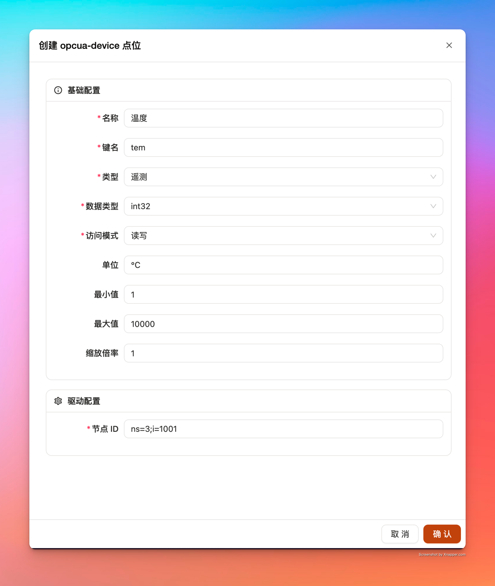

## 11. 查看采集数据（监控）

在菜单选择 **「运维」->「监控」**：

1. 在监控页面选择南向通道（例如 `opcua`）
2. 选择南向设备（例如 `opcua-device`）
3. 查看点位数据是否持续刷新/变化

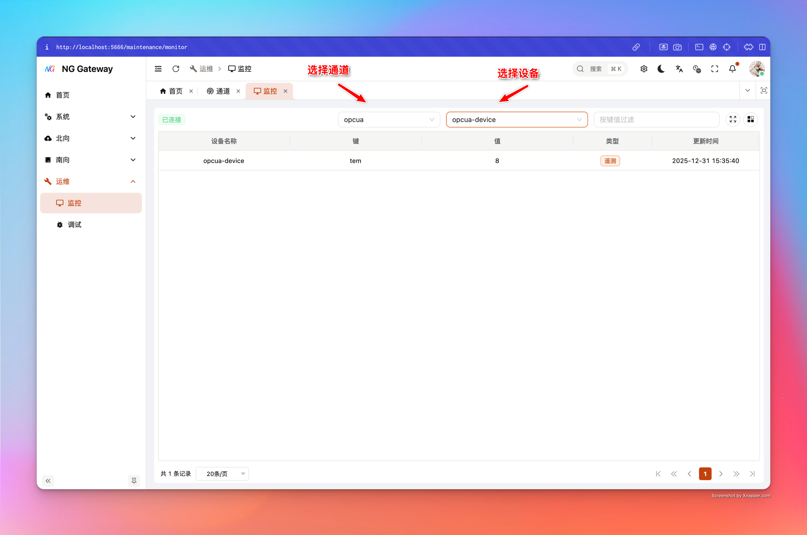

如果数据不更新：

- 确认通道连接状态为 `Connected`
- 确认 `readMode` 与 `collectionType/period` 组合正确
- 确认 Simulation Server 的变量在变化
