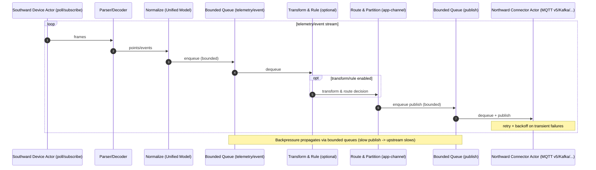
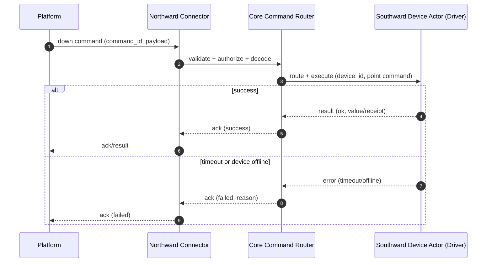
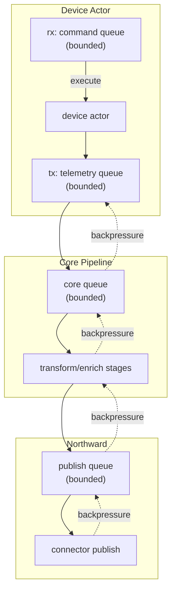

# 架构概览

NG Gateway 是面向 **工业/边缘场景** 的高性能 IoT 网关：它把南向设备协议采集到的高频数据，通过 **统一数据模型 + 可控背压的事件管线** 输送到北向通道，并以插件化方式持续演进。

<a id="rust-core"></a>

## Rust 高性能内核

核心运行时基于 `tokio` 异步模型。为了把“高并发 + 高吞吐 + 可控资源”同时做到位，我们遵循下面的架构范式：

- **任务隔离（Fault Isolation）**：以设备/通道/插件为粒度拆分任务，避免单点异常扩散。
- **背压优先（Backpressure First）**：所有关键事件流使用 **有界队列**，把“慢”从隐性堆积变成显性可控。
- **结构化并发（Structured Concurrency）**：任务有明确父子关系，stop/reload 有干净的取消路径与超时上限。

<a id="overview"></a>

## 一张图看懂 NG Gateway

> Tips：这是逻辑视图（不是物理部署图）。实际部署可以单机、容器、或 Helm 集群化。

```text
┌───────────────────────────────────────────────────────────────────────┐
│                              NG Gateway                               │
│                                                                       │
│  ┌───────────────┐    ┌───────────────────────┐    ┌────────────────┐ │
│  │   Southward   │    │   Core Pipeline       │    │   Northward    │ │
│  │  Drivers/IO   │───▶│  (async + backpressure│───▶│  Connectors    │ │
│  │  Modbus/S7/...│    │   + transform)        │    │  MQTT/Kafka/...│ │
│  └───────▲───────┘    └───────────▲───────────┘    └───────▲────────┘ │
│          │                        │                        │          │
│          │                        │                        │          │
│   ┌──────┴──────┐        ┌────────┴────────┐       ┌───────┴───────┐  │
│   │  Device/    │        │  Data Model     │       │  Plugins      │  │
│   │  Driver Conf│        │  & Events       │       │  Enrichment   │  │
│   └─────────────┘        └─────────────────┘       └───────────────┘  │
│                                                                       │
│  Observability (tracing/metrics)  |  Security (TLS/AuthZ)  | Storage  │
└───────────────────────────────────────────────────────────────────────┘
```

<a id="design-goals"></a>

## 设计目标与关键取舍

NG Gateway 面向的是“**小包高频 + 多协议并存**”的真实工业现场，这决定了架构优先级：

- **吞吐与稳定性优先**：所有关键链路必须能承受峰值；系统要在外部依赖不稳定时自我保护。
- **可扩展而不失控**：支持驱动/插件运行时热插拔、按需启用以及独立配置，但核心路径保持可观测、可调参、可回收。
- **统一语义与数据模型**：避免“每个协议一套模型”，确保北向对接与业务规则能复用。
- **运维友好**：可定位、可回放、可回滚；关键指标可度量；出错信息有上下文。

<a id="planes"></a>

## 两个平面：数据面与控制面

架构上显式区分两个平面（这会显著降低复杂度）：

- **数据面**：南向采集 → 标准化 → 转换/路由 → 北向投递（高频、吞吐敏感）
- **控制面**：配置/指令/生命周期管理（低频、强一致/可审计更重要）

### 数据面



### 控制面



<a id="queues"></a>

## 队列与背压设计：有界不是“一个开关”，而是体系结构

背压要“真正生效”，必须在关键边界放置有界队列，并明确满了之后的策略（阻塞/丢弃/降级）：



> 关键点：背压策略必须与业务语义匹配。不是所有消息都值得“无限重试”。

<a id="dataflow"></a>

## 数据流与背压：从南向到北向

从数据视角，网关应当是一条明确、可观测、可背压的流水线：

```text
  → Southward (drivers)
  → Normalize (unified model)
  → Transform/Enrich (optional stages)
  → Route (topic/app/channel)
  → Northward (plugins)
```

关键点是 **背压如何传播**：

- 北向变慢 → publish 队列变满 → core 队列变满 → 南向采集节流/退避 → 系统整体稳定
- 任何一个环节都不应该默默把数据堆进无界缓存（这会把风险转成 OOM）

<a id="failure-semantics"></a>

## 失败语义：稳定的系统必须先定义“失败怎么处理”

| 失败点 | 典型原因 | 推荐默认动作 | 需要暴露的可配置项 |
| --- | --- | --- | --- |
| 南向读超时 | 设备忙/线路抖动 | 有限次重试 + 退避 | timeout、retries、backoff |
| 南向解析失败 | 噪声/半包/CRC | 丢弃坏帧 + 重新同步 | max_frame_size、resync |
| 北向 publish 失败 | 断网/鉴权/限流 | 重试 + 退避；必要时降级 | retries、backoff、buffer_policy |
| 队列满 | 下游变慢 | 触发背压；或按语义丢弃 | queue_capacity、drop_policy |
| 下行命令超时 | 设备无响应 | 返回明确失败（可重试） | command_timeout、idempotency |

> 最佳实践：把“失败语义”做成配置 schema 的一部分，并在 metrics 中可视化（重试次数、丢弃数、阻塞时间）。

<a id="southward"></a>

## 南向设备接入

南向的核心职责是：**与现场设备建立连接，可靠采集并解析协议数据，把协议语义映射为统一数据模型**。

南向是“设备世界的适配层”，它需要解决：

- **连接管理**：串口/网口连接高可用、生命周期、断线重连、设备繁忙与超时处理。
- **协议解析容错**：现场数据常常“不完美”，解析必须可恢复（丢帧、CRC 错、半包等）。
- **数据点映射**：把协议寄存器/对象映射到统一的数据模型（point/value/ts/quality）。
- **性能与零拷贝**：解析路径避免频繁分配；对大报文/批量读写支持批处理与预分配。

<a id="northward"></a>

## 北向应用对接

北向的核心职责是：把统一事件/数据点 **可靠、有语义** 地送到云端/平台，并处理平台侧下行控制。

北向通常需要关注：

- **协议与会话**：session、重连与离线缓存策略等。
- **消息模型**：支持 `json` 与 `proto` 两种结构，兼顾易调试与高性能。
- **上行与下行**：上行 telemetry、事件；下行控制/配置/脚本/升级指令等。
- **幂等与去重**：网络抖动与重试会导致重复投递，需要在业务侧有清晰约定。

## 插件化扩展（南向驱动/北向插件/转换/增强）

NG Gateway 的扩展能力建议分层理解：

- **南向驱动**：面向现场协议，负责采集与解析。
- **北向插件**：面向平台协议/SDK，负责上报与控制下发。
- **转换与增强**：对统一模型做规则、映射、清洗、边缘计算、告警等（可作为插件或内置模块）。

插件化的价值不只是“热插拔”，更是 **隔离变更与风险控制**：

- 新增平台对接，不影响核心采集链路。
- 新增协议驱动，只影响对应设备的 IO 任务与解析器。
- 可按需启用，降低攻击面与资源占用。

---
