## 背景

在实际项目中，用户经常需要创建**大量配置相似**的：

- 设备（Device）
- 点位（Point）
- 动作（Action）

如果完全依赖手工逐条填写 UI 表单，过程会非常耗时且容易出错；在大规模部署（成百上千设备/点位）时问题会被放大。

因此我们引入 **Driver Metadata Schema**：

- 用一份“驱动特定配置”的结构化 Schema，**自动映射/渲染**出对应的 UI 表单
- 用同一份 Schema **自动生成 Excel 导入模板**（含下拉枚举、校验规则、隐藏元信息）
- 导入时按 Schema 做一致的**校验/归一化/映射**，降低错误率并提升吞吐

::: tip 关键原则
Schema 是“驱动配置的描述”，不是业务逻辑；它的目标是让 UI/导入在不写或变更额外前端代码的情况下跟随驱动演进。
:::

## 数据结构

Driver Metadata Schema 的核心类型是 `ng-gateway-sdk::ui_schema::DriverSchemas`，按实体拆成 4 份：

- **channel**：通道（Channel）级驱动配置
- **device**：设备（Device）级驱动配置
- **point**：点位（Point）级驱动配置
- **action**：动作参数（Action Parameters）级驱动配置

每一份 Schema 都由 `Node` 组成，Node 有 3 种形态：

- **Field**：一个字段（输入框/开关/枚举等）
- **Group**：一个分组（用于 UI 折叠/排序/组织）
- **Union**：一个“联合类型/分支”（用 discriminator 决定显示哪一组子字段）

### Field 的关键字段

一个 `Field` 主要包含：

- **path**：字段路径
- **label**：字段显示名（支持国际化）
- **data_type**：类型（String/Integer/Float/Boolean/Enum/Any）
- **default_value**：默认值（可选）
- **ui**：UI 提示（placeholder/help/col_span/disabled 等）
- **rules**：校验规则（required/min/max/length/pattern，支持自定义错误文案）
- **when**：条件（基于其它字段值决定show/required/disabled等）

## 宏用法

### `ui_text!`：在 schema 中写入可本地化文本

- **用途**：给 `label/description/help/placeholder/enum item` 等文本提供国际化值（最少建议包含 `en-US` + `zh-CN`）。
- **常见写法**：
  - `ui_text!(en = "Port", zh = "端口")`
  - `ui_text!({ "en-US" => "Port", "zh-CN" => "端口" })`
  - `ui_text!("Port")`（不需要多语言时）

::: tip
UI 端会按当前语言做 fallback（当前 locale → base language → en-US → zh-CN → 任意可用）。
:::

### `ng_driver_factory!`：导出驱动工厂与静态 metadata（DriverSchemas）

- **用途**：在驱动动态库中导出必要的 C ABI 符号（版本、driver_type、factory ctor、metadata JSON 指针等），供网关在 probe/安装/运行时加载。
- **关键参数**：
  - `name`：驱动名称
  - `description`：驱动描述（可选）
  - `driver_type`：驱动唯一标识
  - `factory`：实现了 SouthwardDriverFactory 的工厂类型
  - `metadata_fn`：返回 `DriverSchemas` 的函数（通常是 `build_metadata`）
  - `channel_capacity`：可选；驱动内部 actor 队列容量

## Schema 如何被网关使用

### 1) 驱动导出 Schema（随动态库发布）

每个南向驱动 crate 会提供一个 `build_metadata() -> DriverSchemas`，并在 `lib.rs` 里通过 `ng_driver_factory!` 宏导出：

- 驱动基础信息：name/description/driver_type/factory
- **静态 metadata（DriverSchemas）**：通过 C ABI 以 JSON bytes 形式暴露给网关驱动加载器

::: tip 最小示例：

```rust
use factory::EthernetIpDriverFactory;
use metadata::build_metadata;
use ng_gateway_sdk::ng_driver_factory;

ng_driver_factory!(
    name = "Ethernet/IP",
    description = "Ethernet/IP industrial protocol driver for Allen-Bradley PLCs",
    driver_type = "ethernet-ip",
    factory = EthernetIpDriverFactory,
    metadata_fn = build_metadata
);
```

```rust
use ng_gateway_sdk::{ui_text, DriverSchemas, Field, Node, RuleValue, Rules, UiDataType};
use serde_json::json;

/// Build static metadata once to be embedded as JSON for the gateway UI/config.
pub(super) fn build_metadata() -> DriverSchemas {
    DriverSchemas {
        channel: build_channel_nodes(),
        device: build_device_nodes(),
        point: build_point_nodes(),
        action: build_action_nodes(),
    }
}

/// Build static metadata once to be embedded as JSON for the gateway UI/config.
pub(super) fn build_metadata() -> DriverSchemas {
    DriverSchemas {
        channel: build_channel_nodes(),
        device: build_device_nodes(),
        point: build_point_nodes(),
        action: build_action_nodes(),
    }
}

/// Build channel-level configuration nodes for the Ethernet/IP driver.
fn build_channel_nodes() -> Vec<Node> {
    vec![
        Node::Field(Box::new(Field {
            path: "host".into(),
            label: ui_text!(en = "Host", zh = "主机"),
            data_type: UiDataType::String,
            rules: Some(Rules {
                required: Some(RuleValue::WithMessage {
                    value: true,
                    message: Some(ui_text!(
                        en = "Host is required",
                        zh = "主机是必填项"
                    )),
                }),
                // Hostname (RFC-1123 labels) or IPv4
                pattern: Some(RuleValue::WithMessage {
                    value: "^(?:(?:[A-Za-z0-9](?:[A-Za-z0-9-]{0,61}[A-Za-z0-9])?)(?:\\.(?:[A-Za-z0-9](?:[A-Za-z0-9-]{0,61}[A-Za-z0-9])?))*|(?:(?:25[0-5]|2[0-4]\\d|1\\d\\d|[1-9]?\\d)\\.){3}(?:25[0-5]|2[0-4]\\d|1\\d\\d|[1-9]?\\d))$".to_string(),
                    message: Some(ui_text!(
                        en = "Enter a valid IPv4 address or hostname",
                        zh = "请输入有效的 IPv4 或主机名"
                    )),
                }),
                ..Default::default()
            }),
            default_value: None,
            order: Some(1),
            ui: None,
            when: None,
        })),
        Node::Field(Box::new(Field {
            path: "port".into(),
            label: ui_text!(en = "Port", zh = "端口"),
            data_type: UiDataType::Integer,
            rules: Some(Rules {
                required: Some(RuleValue::WithMessage {
                    value: true,
                    message: Some(ui_text!(
                        en = "Port is required",
                        zh = "端口是必填项"
                    )),
                }),
                min: Some(RuleValue::WithMessage {
                    value: 1.0,
                    message: Some(ui_text!(
                        en = "Port must be greater than 0",
                        zh = "端口必须大于0"
                    )),
                }),
                max: Some(RuleValue::WithMessage {
                    value: 65535.0,
                    message: Some(ui_text!(
                        en = "Port must be less than 65536",
                        zh = "端口必须小于65536"
                    )),
                }),
                ..Default::default()
            }),
            default_value: Some(json!(44818)),
            order: Some(2),
            ui: None,
            when: None,
        })),
        Node::Field(Box::new(Field {
            path: "timeout".into(),
            label: ui_text!(en = "Timeout (ms)", zh = "超时时间 (ms)"),
            data_type: UiDataType::Integer,
            rules: Some(Rules {
                min: Some(RuleValue::WithMessage {
                    value: 100.0,
                    message: Some(ui_text!(
                        en = "Timeout must be at least 100ms",
                        zh = "超时时间至少为 100ms"
                    )),
                }),
                ..Default::default()
            }),
            default_value: Some(json!(2000)),
            order: Some(3),
            ui: None,
            when: None,
        })),
        Node::Field(Box::new(Field {
            path: "slot".into(),
            label: ui_text!(en = "Slot", zh = "插槽号"),
            data_type: UiDataType::Integer,
            default_value: Some(json!(0)),
            order: Some(4),
            ui: None,
            rules: Some(Rules {
                required: Some(RuleValue::WithMessage {
                    value: true,
                    message: Some(ui_text!(en = "Slot is required", zh = "插槽号是必填项")),
                }),
                min: Some(RuleValue::WithMessage {
                    value: 0.0,
                    message: Some(ui_text!(
                        en = "Slot must be non-negative",
                        zh = "插槽号必须是非负数"
                    )),
                }),
                max: Some(RuleValue::WithMessage {
                    value: 255.0,
                    message: Some(ui_text!(
                        en = "Slot must be less than 256",
                        zh = "插槽号必须小于256"
                    )),
                }),
                ..Default::default()
            }),
            when: None,
        })),
    ]
}

/// Build device-level configuration nodes for the Ethernet/IP driver.
fn build_device_nodes() -> Vec<Node> {
    vec![]
}

/// Build point-level configuration nodes for the Ethernet/IP driver.
fn build_point_nodes() -> Vec<Node> {
    vec![Node::Field(Box::new(Field {
        path: "tagName".into(),
        label: ui_text!(en = "Tag Name", zh = "标签名称"),
        data_type: UiDataType::String,
        default_value: None,
        order: Some(1),
        ui: None,
        rules: Some(Rules {
            required: Some(RuleValue::WithMessage {
                value: true,
                message: Some(ui_text!(
                    en = "Tag Name is required",
                    zh = "标签名称是必填项"
                )),
            }),
            ..Default::default()
        }),
        when: None,
    }))]
}

/// Build action-level configuration nodes for the Ethernet/IP driver.
fn build_action_nodes() -> Vec<Node> {
    // Actions typically reuse point configuration or define specific commands.
    // For basic tag writing, we might just need the tag name.
    vec![Node::Field(Box::new(Field {
        path: "tagName".into(),
        label: ui_text!(en = "Tag Name", zh = "标签名称"),
        data_type: UiDataType::String,
        default_value: None,
        order: Some(1),
        ui: None,
        rules: Some(Rules {
            required: Some(RuleValue::WithMessage {
                value: true,
                message: Some(ui_text!(
                    en = "Tag Name is required",
                    zh = "标签名称是必填项"
                )),
            }),
            ..Default::default()
        }),
        when: None,
    }))]
}
```
:::

### 2) 网关 probe/安装时提取并落库

网关在 probe/安装驱动时会：

- 动态加载驱动库并读取导出的 metadata JSON
- 解析成 `DriverSchemas`
- 把 schemas 存入数据库

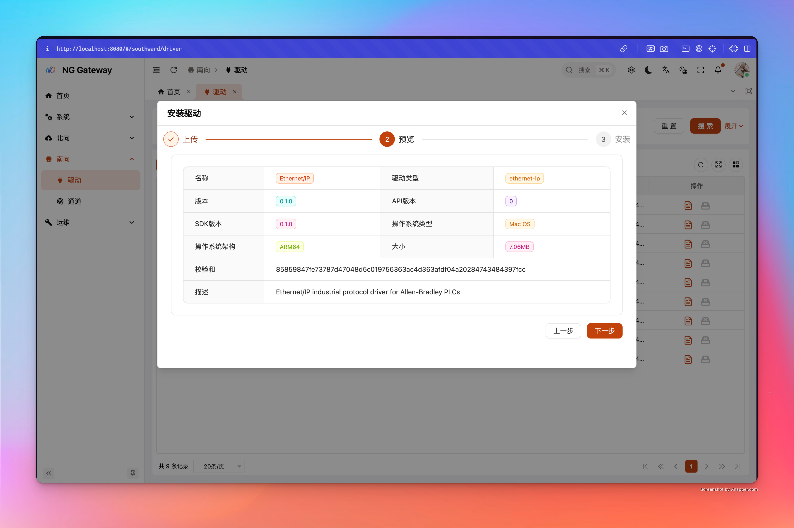
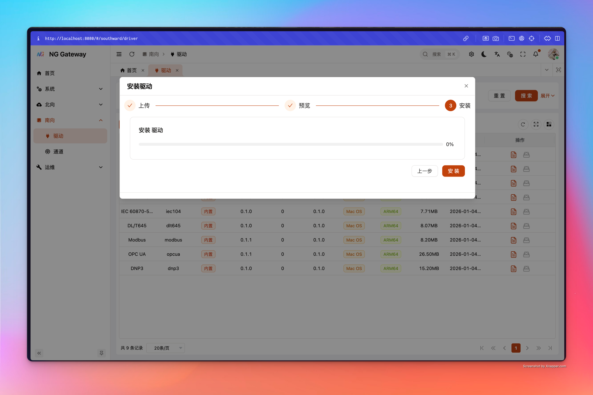

### 3) UI 动态渲染表单

当用户在 UI 创建/编辑：

- Channel 的 driver_config
- Device 的 driver_config
- Point 的 driver_config
- Action 的参数及其 driver_config

前端会拉取对应 DriverSchemas，然后按 schema 结构动态渲染表单控件，并用 `rules/when/default_value` 做校验与交互。

### 4) Excel 模板生成与导入校验

网关可以为每个驱动生成 Excel 模板并提供 **Web 端下载入口**：

在左侧菜单选择 **「南向」->「驱动」** 进入驱动管理界面

<a id="driver-template-download"></a>

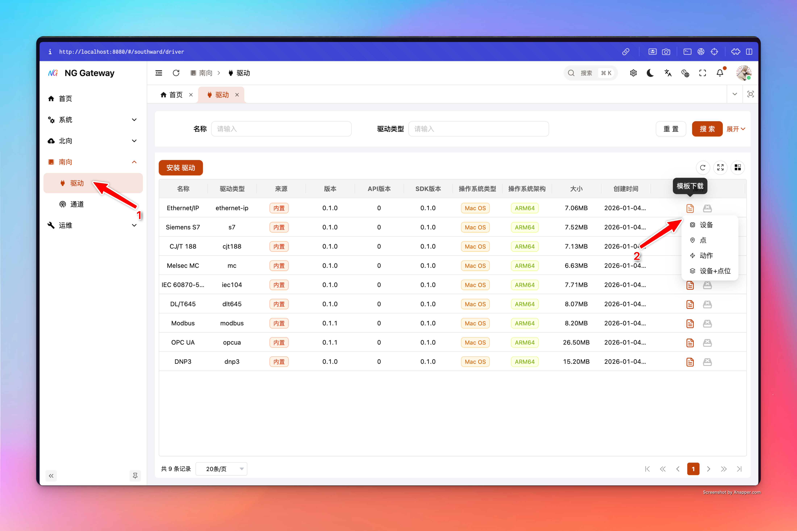

模板特性：

- 第一行是**本地化表头**（导入时按表头匹配列；不要改表头）
- 会写入隐藏的 `__meta__` sheet（包含 driver_type、entity、locale、schema_version 等），用于导入时做兼容校验
- enum 字段会生成下拉框（减少拼写错误）

导入时，后端会读取 `__meta__` 校验模板是否属于当前驱动，并按 schemas 对每行进行：

- 字段必填/范围/格式校验
- 条件显示字段（when）与 Union discriminator 的粗校验
- 类型归一化（例如枚举 label → 枚举 code）
- 映射到 domain 模型并提交（commit）

导入入口：
在左侧菜单选择 **「南向」->「通道」** 进入通道管理界面
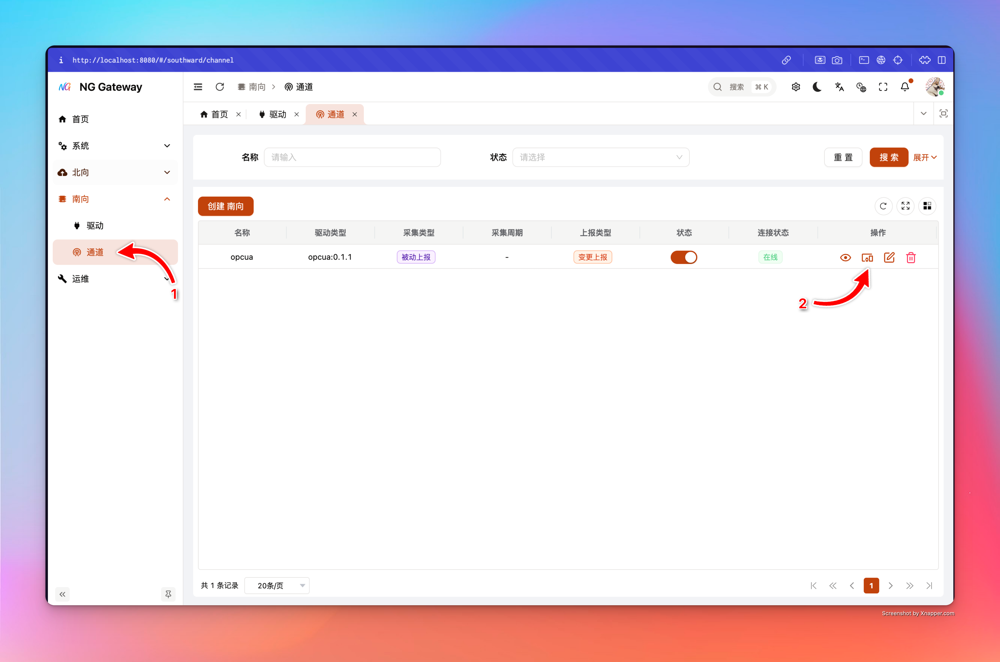

- **Device（归属 Channel）**
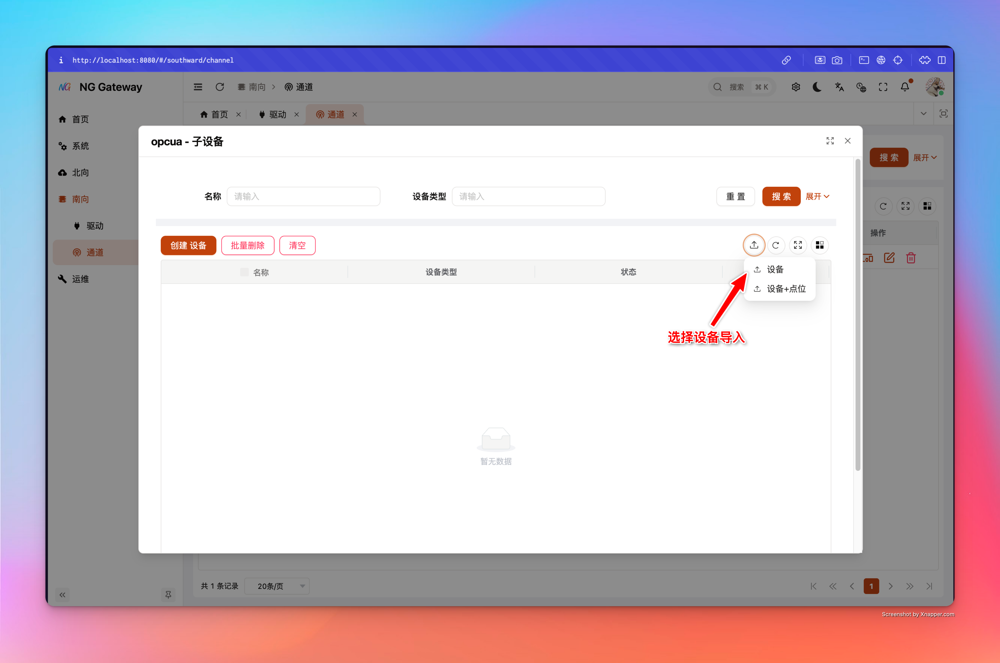
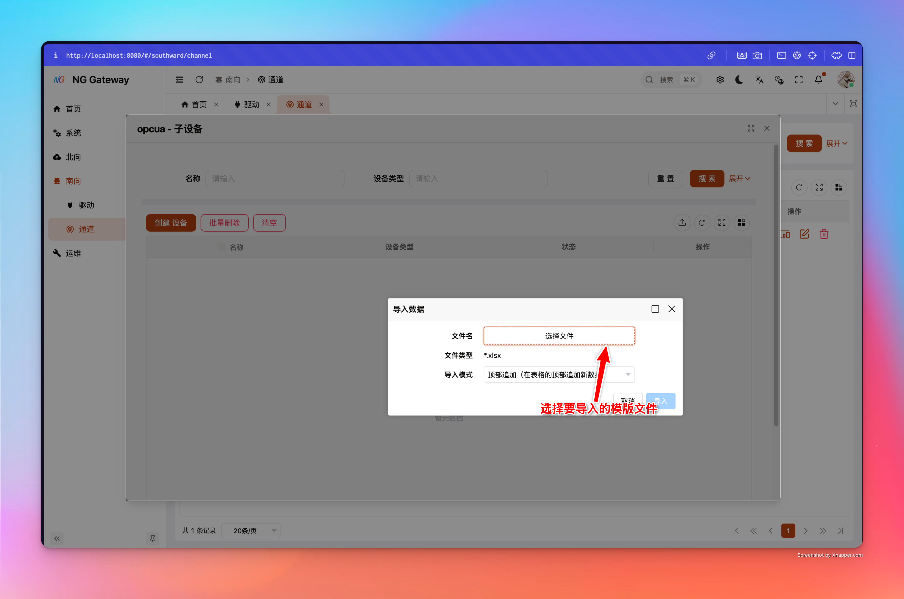
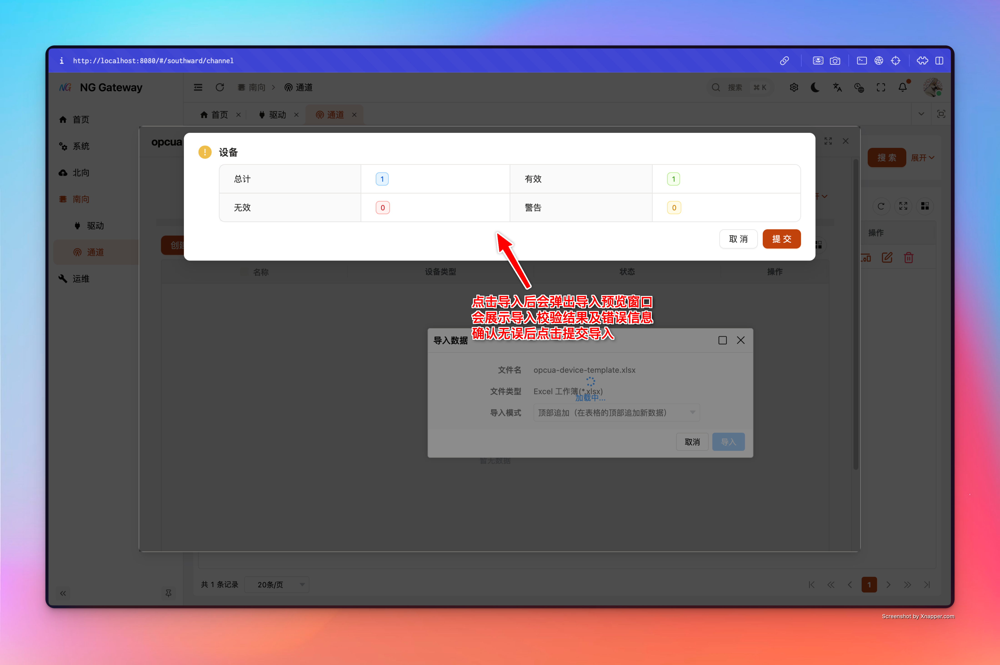

- **Device + Points（归属 Channel）**
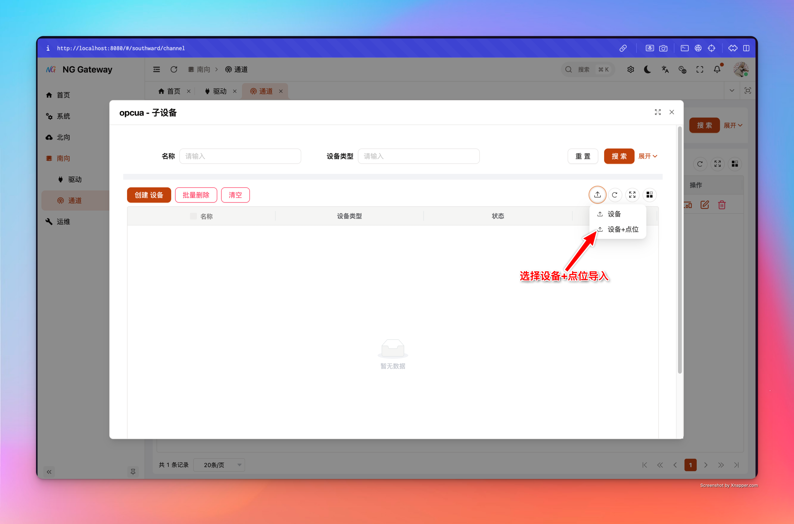


- **Point（归属 Device）**
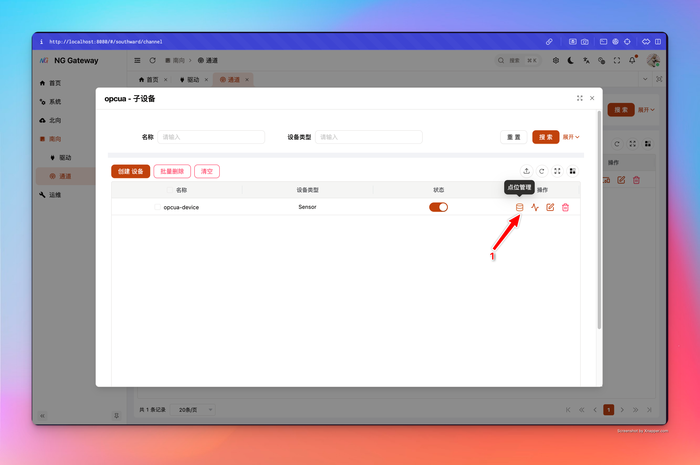
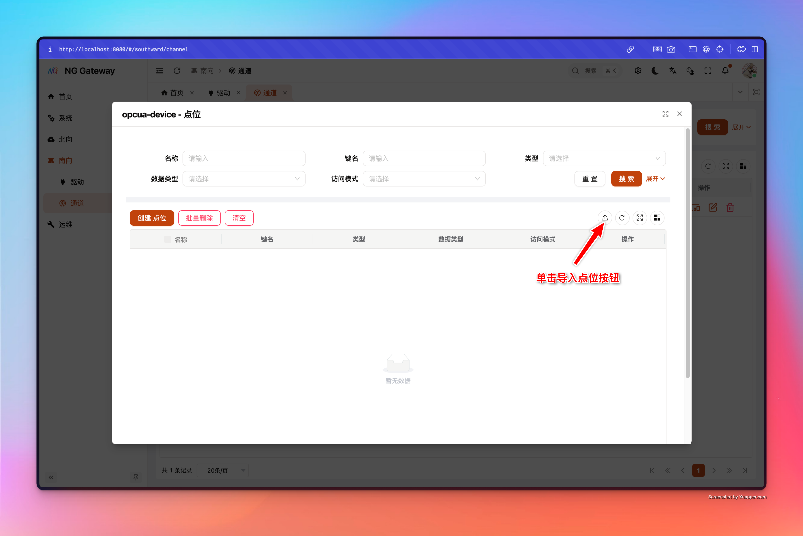


- **Action（归属 Device）**

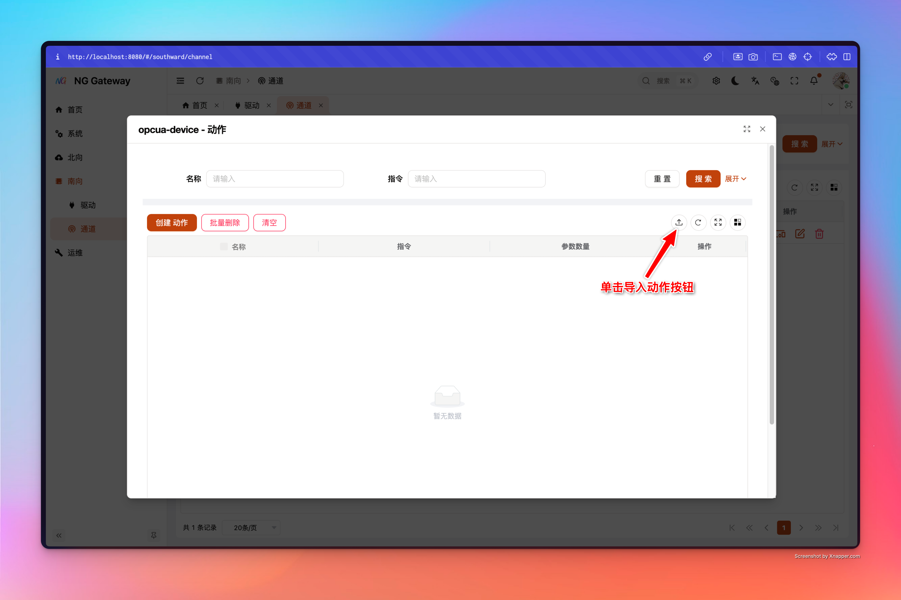


## 常见问题

### 1) 为什么我自己建了个 Excel，导入总是失败？

导入会强依赖模板里的 `__meta__`（driver_type/entity/locale/schema_version）与表头匹配。请始终从网关下载模板再填写。

### 2) 同一个动作为什么要“多行”？

Action 的 Excel 模板是一行一个参数；系统会按 `(动作名称, 命令)` 聚合多行参数为一个动作（适合把多个现场写入点位封装为一个“业务动作”）。


